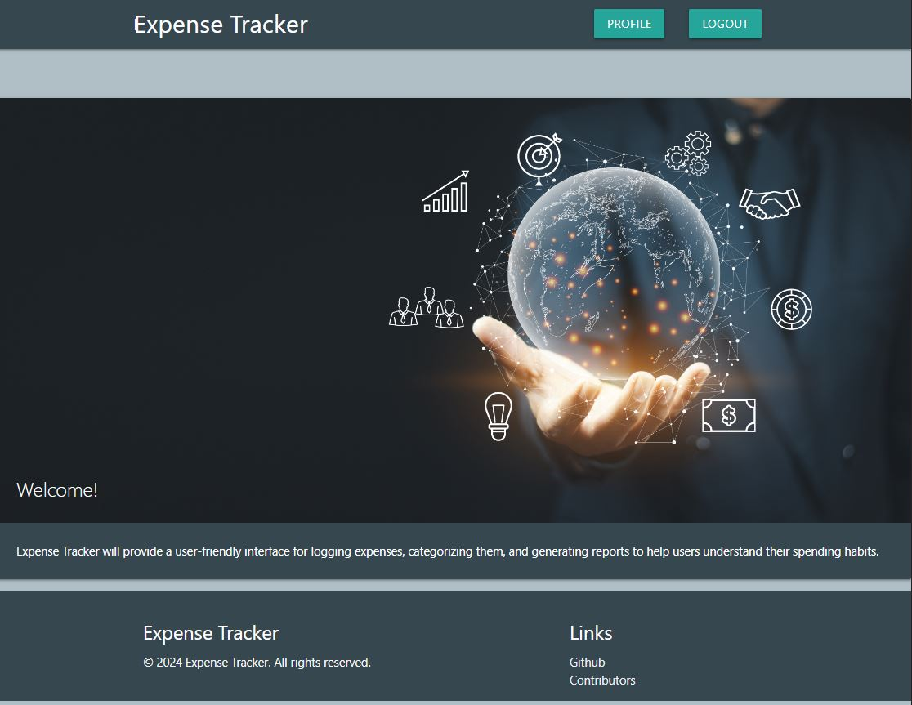

# Expense Tracker Dashboard

## Project Description

A web application that allows users to easily track and manage their expenses. The Expense Tracker will provide a user-friendly interface for logging expenses, categorizing them, and generating reports to help users understand their spending habits.

## User Story

- As a consumer
- I WANT to track my expenses
- SO THAT I can evaluate and manage my spending habits.

## Deployment Screenshot

[Deployment Link](https://tracker-of-expenses-5d12b9bcba5b.herokuapp.com/)

## Task Breakdown

### Project Setup:

- Initialize a new Node.js project.
- Set up the project folder structure following the MVC paradigm.
- Install necessary dependencies, including Express.js, Handlebars.js, Sequelize, Chart.js, and other required packages.

### Database Setup:

- Create a MySQL database to store user accounts, expense data, and categories.
- Define Sequelize models for users, expenses, and categories.
- Establish associations between models (e.g., a user has many expenses).

### User Authentication:

- Create registration and login routes with validation.
- Secure user passwords using hashing.

### Expense CRUD Operations:

- Set up routes and controllers for creating, reading, updating, and deleting expenses.
- Implement middleware to ensure that users can only manage their own expenses.

### Handlebars Views:

- Design Handlebars views for displaying the expense tracker dashboard, expense list, and analytics.
- Use partials for reusable components (e.g., header, footer).

### Interactive Charts:

- Integrate Chart.js to create interactive charts for expense analytics.
- Display charts showing spending trends, category distribution, and monthly summaries.

### Expense Categories:

- Implement the ability for users to categorize expenses.
- Create routes and views for managing expense categories.

### Budgeting Feature:

- Allow users to set monthly budgets for different expense categories.
- Implement logic to compare actual spending against budgeted amounts.

### Responsive Design:

- Ensure that the UI is responsive and looks good on various devices.
- Test the application on different screen sizes and optimize the layout accordingly.

### Environment Variables:

- Store sensitive information (database credentials, session secrets) as environment variables.

### Deployment on Heroku:

- Configure the application for deployment on Heroku.
- Set up a Heroku database add-on and ensure proper connection.

### Testing:

- Conduct thorough testing of each feature, including unit tests for controllers and integration tests for routes.
- Fix any bugs or issues identified during testing.

### Documentation:

- Write a comprehensive README with instructions on setting up and running the project locally.
- Include information on user authentication, routes, and any environment variables needed.

### Polishing and Refinement:

- Refine the UI for a polished and professional look.
- Fine-tune any remaining aspects of the application for a seamless user experience.

### Deployment:

- Deploy the application on Heroku.
- Ensure that the deployed app is accessible and functional.

## Contributors

- Travis Fowlston
- Logan Fullerton
- Neilsen Zulueta
